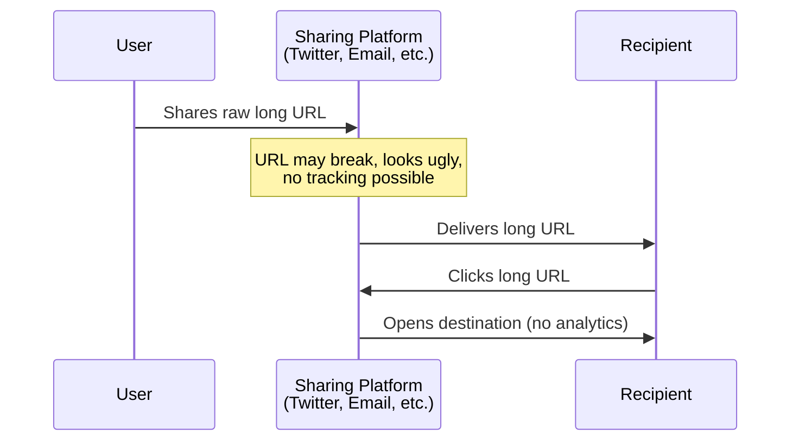
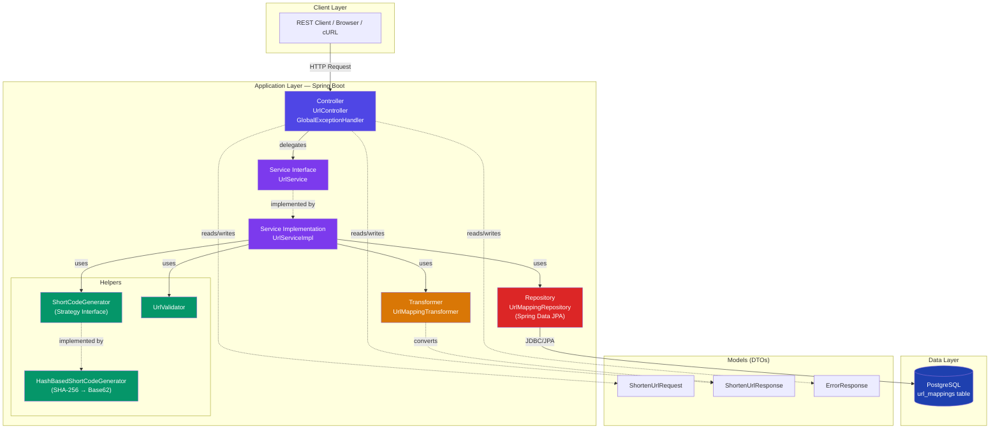
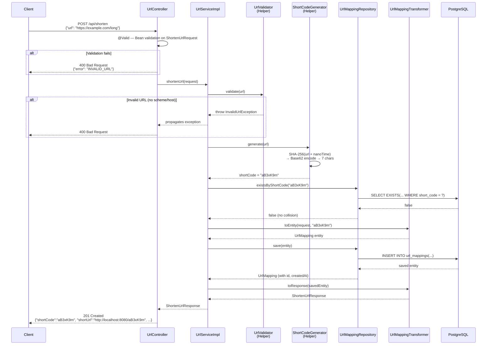
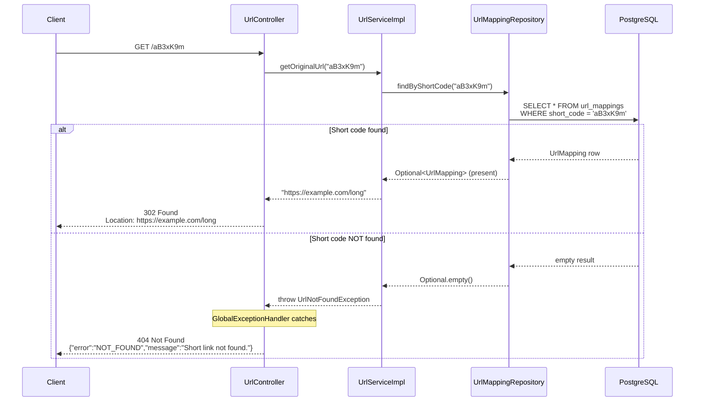
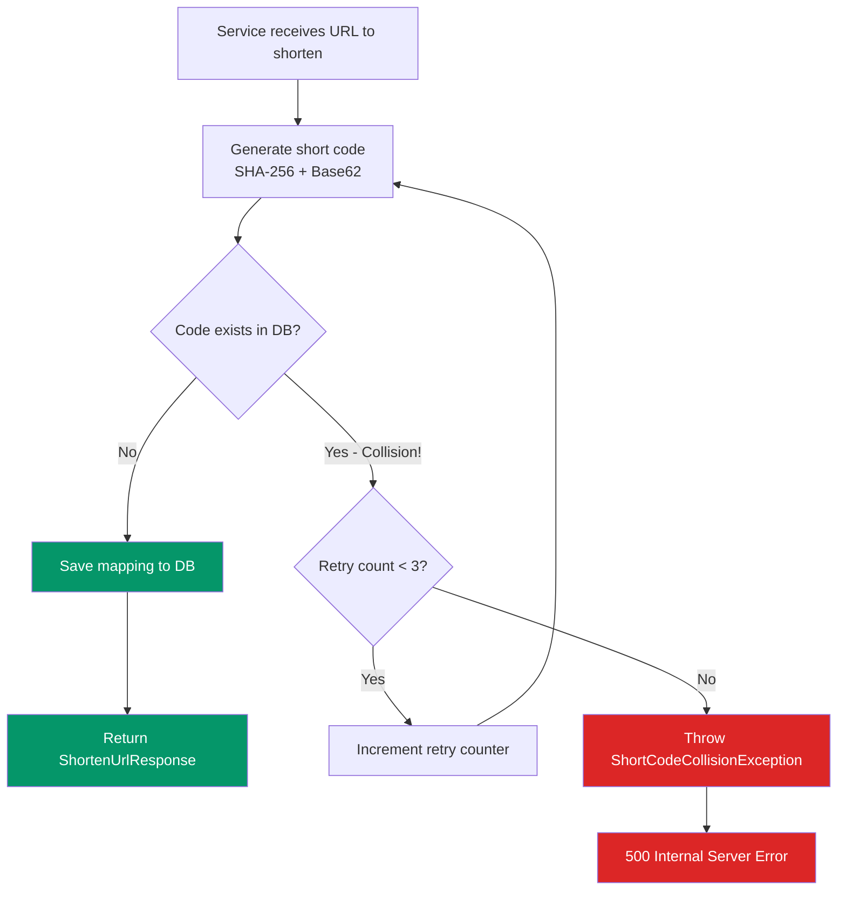
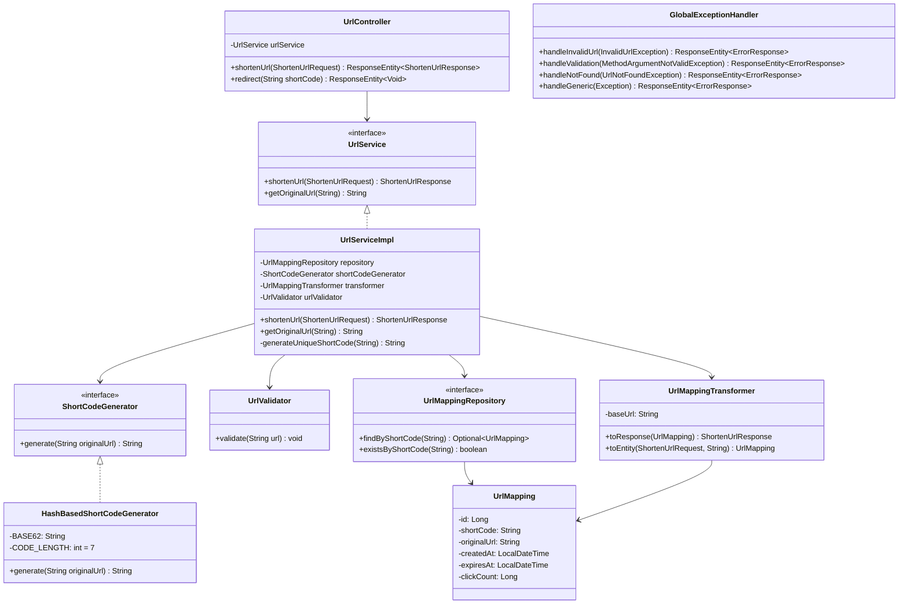
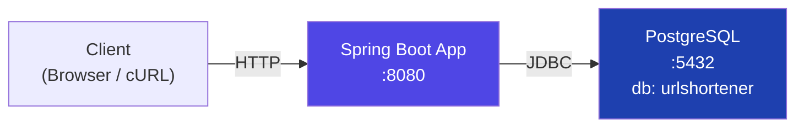

# URL Shortener — Technical Solution Document

---

## Contributors

| Role | Name |
|---|---|
| **Authored by** | Akash Katiyar |
| **Reviewed by** | *Pending Review* |

---

## Background & Problem Description

### Context

Users frequently share URLs across platforms — social media (Twitter/X has character limits), messaging apps, emails, QR codes, and presentations. Raw URLs present several problems:

1. **Readability** — `https://example.com/campaigns/2026/spring-sale?utm_source=twitter&utm_medium=social&ref=ak123` is ugly and hard to share
2. **Copy-paste breakage** — Long URLs often break across lines in emails and documents
3. **No analytics visibility** — Sharing raw URLs provides zero insight into click-through rates, geographic distribution, or referral sources
4. **No control post-share** — Once shared, you can't expire, redirect, or manage a raw URL

### Problem Statement

We need to build a **URL Shortening Service** that converts long URLs into short, shareable links and redirects visitors back to the original URL. This is a greenfield project — there is no existing system.

### Who is this for?

- **End users** — Anyone who wants to shorten and share links
- **Developers** — API consumers who integrate link shortening into their products
- **Product/Marketing teams** — Who want trackable campaign links (future scope)

---

## Requirements

### Functional Requirements (P0 — In Scope)

| # | Requirement | Priority |
|---|---|---|
| FR-1 | Accept a long URL and return a shortened URL with a unique 7-character code | **P0** |
| FR-2 | Redirect visitors of the short URL to the original long URL via HTTP 302 | **P0** |
| FR-3 | Return appropriate error responses for invalid URLs (400), unknown short codes (404), and server errors (500) | **P0** |

### Non-Functional Requirements

| # | Requirement | Details |
|---|---|---|
| NFR-1 | **Low Latency Redirects** | Redirect lookup should be < 10ms at DB level |
| NFR-2 | **Collision Resistance** | Short code generation must handle collisions transparently |
| NFR-3 | **Extensibility** | Architecture must allow adding expiry, analytics, custom aliases (P1) without modifying existing code |
| NFR-4 | **Clean Separation** | Strict layered architecture — no business logic in controllers, no HTTP awareness in services |

### Out of Scope (for this phase)

- Link expiry / TTL (P1)
- Click analytics (P1)
- Custom aliases (P1)
- User authentication / link management dashboard (P2)
- Rate limiting (P2)

### Constraints

- **Tech Stack:** Java 17+ with Spring Boot 3.x, PostgreSQL, Maven
- **Short Code Length:** 7 characters (Base62 = 62⁷ ≈ 3.5 trillion combinations)
- **Redirect Type:** HTTP 302 (temporary) to preserve analytics capability in P1

---

## Current Flow

**There is no existing system.** This is a greenfield build. The "current flow" is a user manually sharing raw long URLs:



**Problems with current state:**
- No short link exists — users share raw URLs
- No redirect layer — can't track, expire, or manage links
- No error handling — broken links silently fail

---

## Proposed Changes

### HLD

#### System Architecture



#### Shorten URL Flow (POST /api/shorten)



#### Redirect Flow (GET /:shortCode)



#### Collision Handling Flow



---

### LLD

#### Data Model Changes

**New table: `url_mappings`** in PostgreSQL database `urlshortener`

| Field | Type | Constraints | Description |
|---|---|---|---|
| `id` | `BIGSERIAL` | `PRIMARY KEY` | Auto-incrementing surrogate key |
| `short_code` | `VARCHAR(10)` | `NOT NULL`, `UNIQUE` | The generated 7-char Base62 code |
| `original_url` | `TEXT` | `NOT NULL` | The original long URL (unbounded length) |
| `created_at` | `TIMESTAMP` | `NOT NULL`, `DEFAULT NOW()` | Creation timestamp, set via `@PrePersist` |
| **`expires_at`** | `TIMESTAMP` | `NULL` | *P1-ready:* Optional expiry time, nullable for P0 |
| **`click_count`** | `BIGINT` | `NOT NULL`, `DEFAULT 0` | *P1-ready:* Click counter, defaults to 0 for P0 |

**Indexes:**

| Index Name | Column(s) | Type | Purpose |
|---|---|---|---|
| `idx_short_code` | `short_code` | B-Tree | **Hot path** — fast redirect lookups via `findByShortCode()` |
| `idx_expires_at` | `expires_at` | Partial (WHERE NOT NULL) | *P1-ready* — efficient expiry cleanup queries |

**DDL:**

```sql
CREATE TABLE url_mappings (
    id              BIGSERIAL       PRIMARY KEY,
    short_code      VARCHAR(10)     NOT NULL UNIQUE,
    original_url    TEXT            NOT NULL,
    created_at      TIMESTAMP       NOT NULL DEFAULT NOW(),
    expires_at      TIMESTAMP       NULL,
    click_count     BIGINT          NOT NULL DEFAULT 0
);

CREATE INDEX idx_short_code ON url_mappings (short_code);
CREATE INDEX idx_expires_at ON url_mappings (expires_at) WHERE expires_at IS NOT NULL;
```

> **Design Decision:** `expires_at` and `click_count` are included now with nullable/default values so that P1 features (TTL, analytics) won't require a schema migration. This is a forward-compatible design choice — these columns cost nearly zero storage when unused.

---

#### JPA Entity: `UrlMapping`

```java
@Entity
@Table(name = "url_mappings")
public class UrlMapping {

    @Id
    @GeneratedValue(strategy = GenerationType.IDENTITY)
    private Long id;

    @Column(name = "short_code", nullable = false, unique = true, length = 10)
    private String shortCode;

    @Column(name = "original_url", nullable = false, columnDefinition = "TEXT")
    private String originalUrl;

    @Column(name = "created_at", nullable = false, updatable = false)
    private LocalDateTime createdAt;

    @Column(name = "expires_at")
    private LocalDateTime expiresAt;

    @Column(name = "click_count", nullable = false)
    private Long clickCount = 0L;

    @PrePersist
    protected void onCreate() {
        this.createdAt = LocalDateTime.now();
    }

    // Getters, Setters, No-arg constructor (JPA requirement)
}
```

---

#### Models (Request / Response DTOs)

**`ShortenUrlRequest`** — Input model

```java
public record ShortenUrlRequest(
    @NotBlank(message = "URL cannot be empty")
    @URL(message = "The provided URL is not valid")
    String url
) {}
```

**`ShortenUrlResponse`** — Output model

```java
public record ShortenUrlResponse(
    String shortCode,
    String shortUrl,
    String originalUrl,
    LocalDateTime createdAt
) {}
```

**`ErrorResponse`** — Standardized error model

```java
public record ErrorResponse(
    String error,      // Machine-readable: "INVALID_URL", "NOT_FOUND", "INTERNAL_ERROR"
    String message,    // Human-readable explanation
    int status         // HTTP status code
) {}
```

---

### Flow Changes

#### New API 1: `POST /api/shorten` — Create Short URL

**Contract:**

| Property | Value |
|---|---|
| Method | `POST` |
| Path | `/api/shorten` |
| Content-Type | `application/json` |
| Auth | None (P0) |

**Request Body:**
```json
{
  "url": "https://example.com/very/long/path?with=params"
}
```

**Success Response — `201 Created`:**
```json
{
  "shortCode": "aB3xK9m",
  "shortUrl": "http://localhost:8080/aB3xK9m",
  "originalUrl": "https://example.com/very/long/path?with=params",
  "createdAt": "2026-02-28T12:00:00"
}
```

**Error Response — `400 Bad Request`:**
```json
{
  "error": "INVALID_URL",
  "message": "The provided URL is not valid.",
  "status": 400
}
```

**Logic:**
1. Controller receives request, Spring validates `@NotBlank` + `@URL` annotations
2. `UrlServiceImpl.shortenUrl()` is called
3. `UrlValidator.validate(url)` performs secondary validation (scheme + host check)
4. `HashBasedShortCodeGenerator.generate(url)` produces 7-char Base62 code
5. Uniqueness check via `repository.existsByShortCode(code)` — retry up to 3x on collision
6. `UrlMappingTransformer.toEntity()` creates the JPA entity
7. `repository.save()` persists to PostgreSQL
8. `UrlMappingTransformer.toResponse()` converts saved entity to response DTO
9. Controller returns `201 Created` with response body

**Backward Compatibility:** N/A — new API

---

#### New API 2: `GET /:shortCode` — Redirect

**Contract:**

| Property | Value |
|---|---|
| Method | `GET` |
| Path | `/{shortCode}` |
| Path Variable | `shortCode` — 7-character Base62 string |
| Auth | None |

**Success Response — `302 Found`:**
- Status: `302`
- Header: `Location: https://example.com/very/long/path?with=params`
- Body: Empty

**Error Response — `404 Not Found`:**
```json
{
  "error": "NOT_FOUND",
  "message": "Short link not found.",
  "status": 404
}
```

**Logic:**
1. Controller extracts `shortCode` from path
2. `UrlServiceImpl.getOriginalUrl(shortCode)` queries `repository.findByShortCode()`
3. If found → return original URL → Controller sends `302` with `Location` header
4. If not found → `UrlNotFoundException` → `GlobalExceptionHandler` returns `404`

**Backward Compatibility:** N/A — new API

---

#### Error Handling — `GlobalExceptionHandler` (`@ControllerAdvice`)

| Scenario | Exception Class | HTTP Status | Error Code | Message |
|---|---|---|---|---|
| Empty or malformed URL format | `MethodArgumentNotValidException` | `400` | `INVALID_URL` | Bean validation message |
| URL missing scheme or host | `InvalidUrlException` | `400` | `INVALID_URL` | Custom validation message |
| Short code not in database | `UrlNotFoundException` | `404` | `NOT_FOUND` | "Short link not found." |
| Short code collision after 3 retries | `ShortCodeCollisionException` | `500` | `INTERNAL_ERROR` | "Something went wrong." |
| Any unexpected error | `Exception` | `500` | `INTERNAL_ERROR` | "Something went wrong." |

> **Security:** Stack traces are logged server-side only. Client always receives a safe, generic message for 500 errors.

---

#### Layer-wise Class Summary



---

## Alternate Approaches

### Short Code Generation Strategy

#### Approach 1: Random String Generation

Generate a random 7-character string from the Base62 character set using `SecureRandom`.

```
SecureRandom.nextInt(62) → pick character → repeat 7 times
```

**Pros:**
- Simplest to implement (5 lines of code)
- No dependency on input data

**Cons:**
- **Collision probability increases** as the DB grows — at 100M URLs, collision rate becomes non-trivial
- No determinism — same URL shortened twice always gets different codes (may or may not be desired)
- Requires more retry attempts as scale increases

---

#### Approach 2: Counter-Based (Auto-increment → Base62)

Use a global counter (DB sequence or AtomicLong) and Base62-encode the counter value.

```
Counter = 1000000 → Base62 = "4C92"
```

**Pros:**
- **Zero collisions** — every number is unique
- Predictable, sequential codes

**Cons:**
- **Predictable URLs** — users can guess/enumerate other short codes (security risk)
- **Single point of coordination** — counter must be synchronized across instances, creating a bottleneck
- Sequential IDs leak business metrics (total number of URLs created)

---

#### Approach 3: Hash-Based (SHA-256 → Base62) ✅ Chosen

Hash the URL + timestamp using SHA-256, take first 8 bytes, convert to Base62, truncate to 7 characters.

```
SHA-256("https://example.com" + nanoTime) → first 8 bytes → Base62 → "aB3xK9m"
```

**Pros:**
- **Extremely low collision probability** — SHA-256 has excellent distribution
- **No coordination needed** — works independently across multiple instances
- **Non-predictable** — codes appear random to users
- **Deterministic per input** — same input+salt always produces same output (debuggable)

**Cons:**
- Slightly more complex than random (marginal)
- Theoretical collision possible (mitigated by retry mechanism with up to 3 attempts)

---

#### Conclusion

**Hash-Based (Approach 3) was chosen** because it provides the best balance of collision resistance, scalability (no coordination), and security (non-predictable codes). The retry mechanism (up to 3 attempts) handles the extremely rare collision case. At 7 characters × Base62, we have **3.5 trillion** possible codes — collision probability remains negligible even at millions of URLs.

---

### Redirect Status Code

#### 301 (Moved Permanently) vs 302 (Found)

| Aspect | 301 | 302 ✅ |
|---|---|---|
| Browser caching | Browsers cache permanently — subsequent clicks bypass our server | No caching — every click hits our server |
| Analytics capability | **Cannot track clicks** after first visit | **Can track every click** |
| SEO juice | Passes link equity to destination | Does not pass link equity |
| Performance | Faster for repeat visitors (cached) | Slightly slower (always server round-trip) |

**Decision:** `302 Found` — we sacrifice minor repeat-visit performance to preserve the ability to track clicks (P1) and support link expiry/updates. This is the industry standard (bit.ly, tinyurl all use 301/302 strategically).

---

## Future Scope

The following enhancements are architecturally supported but not implemented in P0:

| Feature | Phase | Architecture Ready? | Notes |
|---|---|---|---|
| **Link Expiry (TTL)** | P1 | ✅ `expires_at` column exists | Add expiry check in `getOriginalUrl()`, background cleanup scheduler |
| **Click Analytics** | P1 | ✅ `click_count` column exists | Increment counter on redirect (async to avoid latency impact) |
| **Custom Aliases** | P1 | ✅ `short_code` is flexible | Add `customAlias` field to `ShortenUrlRequest`, validate and use instead of generated code |
| **Rich Analytics Dashboard** | P2 | 🔶 New `click_events` table needed | Separate table to store per-click data (timestamp, user-agent, IP, referrer) |
| **User Auth + Link Management** | P2 | 🔶 New `users` table + FK needed | JWT auth, `user_id` FK on `url_mappings`, CRUD endpoints |
| **Rate Limiting** | P2 | 🔶 Redis / in-memory needed | Spring Boot filter/interceptor with sliding window counter |
| **URL Safety Check** | P2 | ✅ Helper pattern supports it | New `UrlSafetyChecker` helper, called before save |
| **Caching (Redis)** | P2 | ✅ Service layer abstraction | Add cache-aside pattern in `getOriginalUrl()` — check Redis before DB |

**Extensibility by design:**
- **Strategy Pattern** on `ShortCodeGenerator` → swap algorithm without touching service
- **Transformer** isolation → add fields without changing business logic
- **Service interface** → decorated or replaced without impacting controller

---

## Infra Changes

### New Infrastructure Required

| Resource | Details | Cost Impact |
|---|---|---|
| **PostgreSQL Database** | Single instance, database name: `urlshortener` | Minimal — local dev uses Docker/local install |
| **Spring Boot Application** | Single instance, port 8080 | Minimal — runs on developer machine |

### P0 Infrastructure Topology



### Scaling Considerations (Future)

- **Horizontal scaling:** Application is stateless — can run multiple instances behind a load balancer
- **DB read replicas:** Redirect reads (hot path) can be served from read replicas
- **Caching layer:** Redis cache for frequently accessed short codes (cache-aside pattern)
- No significant infra cost changes expected for P0

---

## Instrumentation

### Logging

| Event | Log Level | What is Logged |
|---|---|---|
| URL shortened successfully | `INFO` | `shortCode`, `originalUrl` (truncated) |
| Redirect successful | `INFO` | `shortCode` |
| Collision detected & retried | `WARN` | `shortCode`, `attempt number` |
| Collision exhausted (all retries failed) | `ERROR` | `url`, `attempts` |
| Invalid URL submitted | `WARN` | `url` (sanitized) |
| Short code not found | `INFO` | `shortCode` |
| Unexpected error | `ERROR` | Full stack trace (server-side only) |

### Metrics (Future — P1/P2)

| Metric | Type | Description |
|---|---|---|
| `url.shorten.count` | Counter | Total URLs shortened |
| `url.shorten.latency` | Histogram | Time to create a short URL |
| `url.redirect.count` | Counter | Total redirects served |
| `url.redirect.latency` | Histogram | Time to serve a redirect |
| `url.collision.count` | Counter | Short code collisions encountered |
| `url.error.count` | Counter | Errors by type (400, 404, 500) |

> For P0, we rely on application logs via SLF4J/Logback (Spring Boot default). Structured metrics (Micrometer/Prometheus) can be added in P1.

---

## Experimentation

Not applicable for P0. This is a greenfield project with no existing users to A/B test against.

**Future consideration:** When implementing P1 analytics, wecould experiment with:
- 301 vs 302 redirect performance impact
- Different short code lengths (6 vs 7 vs 8) — balancing URL length vs collision rate
- Cache TTL values for Redis (when added)

---

## Performance Testing Plan

### Is Performance Testing Required for P0?

**Not formally required.** P0 is a single-instance developer-machine deployment. However, basic performance validation will be done to establish a baseline.

### Baseline Performance Targets

| Operation | Target (P50) | Target (P99) |
|---|---|---|
| `POST /api/shorten` | < 50ms | < 200ms |
| `GET /:shortCode` (redirect) | < 20ms | < 100ms |

### Approach

1. **Unit-level benchmarking:** Verify `HashBasedShortCodeGenerator` generates 10,000 codes in < 1 second
2. **Load testing (informal):** Use Apache Bench (`ab`) or `hey` to send 1000 concurrent requests
   ```bash
   # Shorten endpoint
   ab -n 1000 -c 10 -p payload.json -T application/json http://localhost:8080/api/shorten

   # Redirect endpoint
   ab -n 1000 -c 50 http://localhost:8080/aB3xK9m
   ```
3. **DB query analysis:** Run `EXPLAIN ANALYZE` on the two critical queries:
   - `SELECT * FROM url_mappings WHERE short_code = ?` (redirect)
   - `SELECT EXISTS(...) WHERE short_code = ?` (collision check)

### Scaling Performance Test (Future — P2)

When ready for production deployment, perform full load testing with:
- 10,000 RPS redirect throughput target
- 1,000 RPS shorten throughput target
- Tools: k6, Gatling, or Locust

---

## Release Plan and Dependencies

### Dependencies

| Dependency | Version | Purpose |
|---|---|---|
| Java JDK | 17+ | Runtime |
| Spring Boot | 3.x | Application framework |
| Spring Data JPA | (managed by Spring Boot) | ORM + Repository pattern |
| PostgreSQL | 14+ | Database |
| Hibernate Validator | (managed by Spring Boot) | Bean validation |
| Maven | 3.8+ | Build tool |

### Release Plan

| Step | Action | Rollback |
|---|---|---|
| 1 | Install Java 17+ and Maven (if not present) | N/A |
| 2 | Set up PostgreSQL database `urlshortener` | `DROP DATABASE urlshortener` |
| 3 | Run DDL script to create `url_mappings` table + indexes | `DROP TABLE url_mappings` |
| 4 | Initialize Spring Boot project with dependencies | Delete project directory |
| 5 | Implement code layer-by-layer (Entity → Repo → Helper → Transformer → Service → Controller) | Git revert |
| 6 | Run unit tests (`mvn test`) | Fix failing tests |
| 7 | Run integration tests (`mvn verify`) | Fix failing tests |
| 8 | Manual verification with `curl` commands | N/A |
| 9 | Start application (`mvn spring-boot:run`) | `Ctrl+C` to stop |

### Migration

No migrations required — this is a greenfield project. The `schema.sql` DDL creates the table from scratch.

### Sequence

```mermaid
gantt
    title P0 Implementation Plan
    dateFormat  HH:mm
    axisFormat  %H:%M

    section Setup
    Project init (Spring Initializr + Maven)    :s1, 00:00, 30min
    DB setup (PostgreSQL + schema)              :s2, after s1, 15min

    section Core Implementation
    Entity + Repository                         :i1, after s2, 30min
    Models (Request/Response DTOs)              :i2, after i1, 15min
    Helpers (ShortCodeGen + Validator)           :i3, after i2, 30min
    Transformer                                 :i4, after i3, 15min
    Service Interface + Impl                    :i5, after i4, 45min
    Controller + ExceptionHandler               :i6, after i5, 30min

    section Config + Testing
    application.yml                             :c1, after i6, 10min
    Unit tests                                  :t1, after c1, 45min
    Integration tests                           :t2, after t1, 30min
    Manual curl verification                    :t3, after t2, 15min
```



---

*Document Version: 1.0 | Created: February 28, 2026 | Status: Pending Review*
